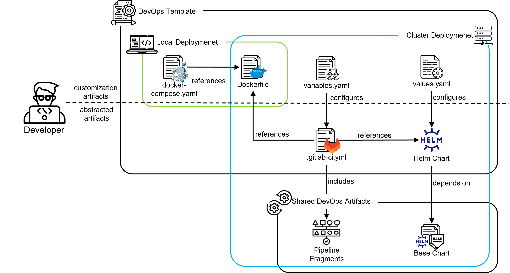

# Best Practice: Applying the CI/CD Templates


Figure: DevOps Template Artifact Overview

Figure "CI/CD Template Artifact Overview" provides an intricate framework detailing the essential elements and relationships inherent in the SEMA deployment and operations lifecycle. Central to it is the template-based approach, where several technology-specific CI/CD templates are offered for the developers. Each of these templates, such as the one for Golang, is meticulously crafted to streamline the integration of application-specific configurations with the deployment environment. These templates offer a blend of specificity and modularity, ensuring that developers have a starting point for their technology stack while also benefiting from the customizability that the abstracted shared DevOps artifacts provide through streamlined configuration interfaces. By leveraging these predefined structures, developers can more efficiently adapt their applications for both local and cluster deployments, striking a balance between customization and standardized operational procedures.

At the outset, the framework makes a clear demarcation between local and cluster deployment artifacts. The local deployment artifacts facilitate developers to run their applications in a local deployment environment. It primarily leverages the docker-compose.yaml and Dockerfile. The docker-compose.yaml, a file for defining and running multi-container Docker applications, references the Dockerfile as the build context. The Dockerfile, in turn, sketches out how the application should be containerized.

The cluster deployment artifacts comprise a robust suite of configuration tools tailored for deployment to a Kubernetes cluster. The variables.yaml artifact specifies configuration parameters that influence the .gitlab-ci.yml, dictating the structure of the CI/CD pipeline. Notably, the .gitlab-ci.yml seamlessly integrates pipeline fragments, modular elements that augment the flexibility of the CI/CD workflow. In a parallel manner, values.yaml drives the configuration of the Helm chart, delineating the blueprint for cluster deployment. It's important to note that this Helm chart relies on the base chart, a foundational template that promotes uniform deployments across a variety of applications.

A distinction is drawn between artifacts based on their level of engagement with developers. Components like the docker-compose.yaml, Dockerfile, variables.yaml, and values.yaml might require customization by developers to align with application requirements. The artifacts serve as streamlined configuration interfaces, contrasting with the other intricate components that maintain a level of abstraction from the developer.

## CI/CD Templates
-  [Golang](https://gitlab.kit.edu/kit/cm/teaching/umedocumentation/cicd/golang)

## Integrate Artifacts from the CI/CD Templates into Existing Project

On your local machine navigate to your project folder and run the following commands. Replace the URL with the required template. Here, the Golang template is used.


1. Add the CI/CD Golang template as a remote target and fetch it.
```
git remote add cicd-golang https://gitlab.kit.edu/kit/cm/teaching/umedocumentation/cicd/golang.git
git fetch cicd-golang
```

1. Integrate CI/CD and deplyoment artifacts in the current branch.
```
git checkout cicd-golang/master .gitlab-ci.yml variables.yaml Dockerfile helm docker-compose.yaml
```
1. Commit and push the changes.
```
git commit -m "merged cicd-golang template"
git push
```

## Local Deployment

For local deployment, utilize the provided docker-compose.yaml file. This file references the Dockerfile and initiates the build process automatically when you run the Docker Compose command.

### 1. Build and Deploy the Microservice
Run the command `docker-compose up` in your terminal. This triggers the build of the local Dockerfile file and starts the containers as defined.

### 2. Access the Microservice
After running the command `docker-compose up`, the microservice will be accessible through your web browser or API client at `http://localhost:80`.

### 3. Redeploy the Microservice
If you need to redeploy the microservice after making changes:

Press `Ctrl+C` in the terminal where `docker-compose up` is running. This command stops the running containers. Run the command `docker-compose up` again to restart the service with the latest changes.

### 4. Clean Up
When you are done and want to completely stop the services and remove the containers, you can run `docker-compose down`.

## Cluster Deployment

The cluster deployment is automatically triggered on each push to the project repository.

### Helm Configuration

The provided Helm chart leverages the BaseChart as a dependency, offering a versatile framework to customize the deployment based on your application's needs. Configuration adjustments are made within the file `helm/values.yaml`. For basic requirements, the provided file is sufficient. However, in more complex deployment scenarios — like database integration or setting up specific network configurations — adjusting the Helm values is imperative. For a comprehensive understanding and guidance, consult the [BaseChart Documentation](https://gitlab.kit.edu/kit/cm/teaching/umedocumentation/cicd/basechart).

### Argo CD

Argo CD is a GitOps continuous deployment controller for Kubernetes. It facilitates the management and synchronization of application deployments in Kubernetes using Git repositories as the source of truth for defining the desired application state. In the C&M BWCluster environment all resources are deployed and controlled by Argo CD.

#### How to Automatically Deploy an Application to Argo CD using the CI/CD Pipeline
Make sure to use the reference `argocd-deploy.yaml`. This will automatically deploy the Helm chart in the folder `helm` of the project's root.

Example:
```yaml
include:
  - project: kit/cm/teaching/engineeringknowledge/cicd/pipeline
    ref: "1"
    file : base.yaml
  - project: kit/cm/teaching/engineeringknowledge/cicd/pipeline
    ref: "1"
    file : argocd-deploy.yaml
```

#### How to Manually add an Application to Argo CD
This method is used to deploy the cluster services, also known as bootstrapping the cluster. Since the pipeline and Argo CD are considered cluster services, tgey must be manually deployed initially to avoid recursive dependencies.

1. Navigate to the page Applications.
2. Click on the button "New App".
3. Enter the application name. If it is a cluster service, it should equal the folder name of that service.
4. For project name choose "default".
5. For sync policy choose "Automatic".
6. In source copy the HTTPS Git URL of the project containting the app.
7. For path choose the folder that contains the helm files or kubernetes manifests.
8. As destination select the default cluster and the desired namespace. Cluster services should usually be deployed in their own namespace.
9. Click create and monitor the creation process.

#### Accessing Argo CD
Go to https://argo.cmcluster.duckdns.org and use the **Log in via GitLab** button to sign in with your KIT GitLab account.

This will get you read-only access to everything in Argo CD. 
To modify resources you will need to change their definition in the Git repository and wait for Argo CD to sync them.

#### Inspect Application in Argo CD
Under **Applications** all applications known to Argo CD can be found. An Argo CD application is a set of Kubernetes resources deployed with Argo CD.

After clicking on an application, an overview of its Kubernetes resources is displayed.
In the top right corner different views can be selected, the most useful of which are **tree** and **network**.
The view **tree** shows a dependency hierarchy of resources, while the view **network** shows the path network traffic takes to get to the containers.

By selecting a resource more details about it are displayed. Under **Live Manifest** the output of the command `kubectl describe` is shown for that resource. When selecting a pod, its logs can be inspected.

Each resource has a _sync status_ and some also have a _health status_.
The _health status_ comes directly from Kubernetes and shows whether Kubernetes thinks the resource is healthy according to the currently applied manifest.
The _sync status_ comes from Argo CD and shows whether the manifest in Kubernetes corresponds to the resource definition in the Git repository.
If a resource is `OutOfSync`, automatic sync for the application is disabled or Argo CD could not apply the change, e.g. because the resource definition is invalid.