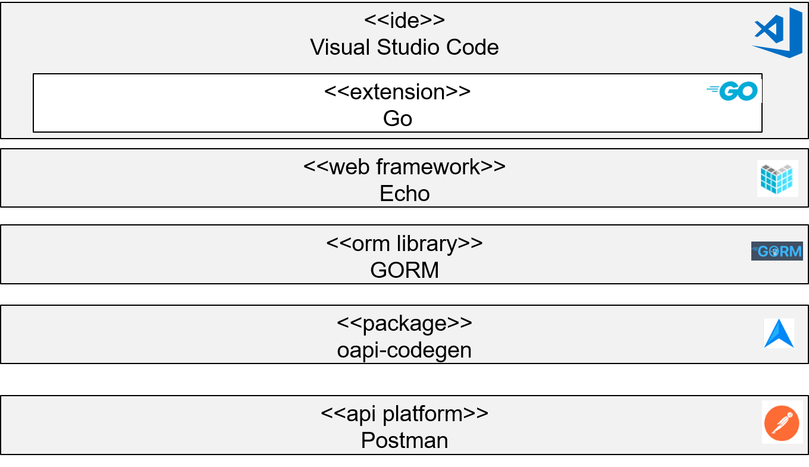

# Best Practice: Go Development in the SEMA Tool Environment

In this Best practice (Be) the tools (including frameworks and libraries) wich are used in the SEMA approach for the development of microservices in Golang are introduced. A focus is on the installation and the basic configuration of the tools.

Figure: "Tools Used for Go Development" provides an overview of the tools which are further described in the following sections of this Be.

Figure: Tools Used for Go Development

## Visual Studio Code (Integrated Development Environment)
Visual Studio (VS) Code is one of the most popular Integrated Development Environments (IDE) for the development of Go code. VS Code is available for all three leading operating systems (Windows, Linux, macOS) [Mic-Dow].

(\<\<extension\>\> Go) The Go extension for VS Code provides features like IntelliSense, code navigation, symbol search, testing, debugging, and many more that will help in Go development [Mic-Goi].

## Echo (Web Framework)
The Echo project is a powerful and versatile web framework for building scalable and high-performance web applications in the Go programming language [Lab-Ech].

## oapi-codegen (Code Generator)
This package contains a set of utilities for generating Go boilerplate code for services based on OpenAPI 3.0 API definitions [Dee-oap].

The Be "Generate Go API Controller From OpenAPI Specification" provides a detailled description how the open-api plugin can be applied. 

## GORM (ORM Library)
GORM (Go Object Relational Mapping) [GOR-The] provides an ORM library which bridges the gap between object-oriented programs and relational databases.

Be "Implementing a Microservice in Golang" includes a description how to use GORM to integrate a PostgreSQL database.

## Postman (API Platform)
The tool Postman is an API platform for building, using, and testing  APIs [Pos-Wha]. The tool can be used to send requests to a HTTP API.

Be "Implementing a Microservice in Golang" includes a description how to create a HTTP request with Postman.

## References
[Dee-oap] DeepMap: oapi-codegen, https://github.com/deepmap/oapi-codegen  
[GOR-The] GORM: The fantastic ORM library for Golang. https://gorm.io/index.html  
[Lab-Ech] LabStack: Echo Project Introduction. https://echo.labstack.com/docs  
[Mic-Dow] Microsoft: Download Visual Studio Code. https://code.visualstudio.com/download  
[Mic-Goi] Microsoft: Go in Visual Studio Code. https://code.visualstudio.com/docs/languages/go  
[Pos-Wha] Postman: What is Postman. https://www.postman.com/product/what-is-postman/  
