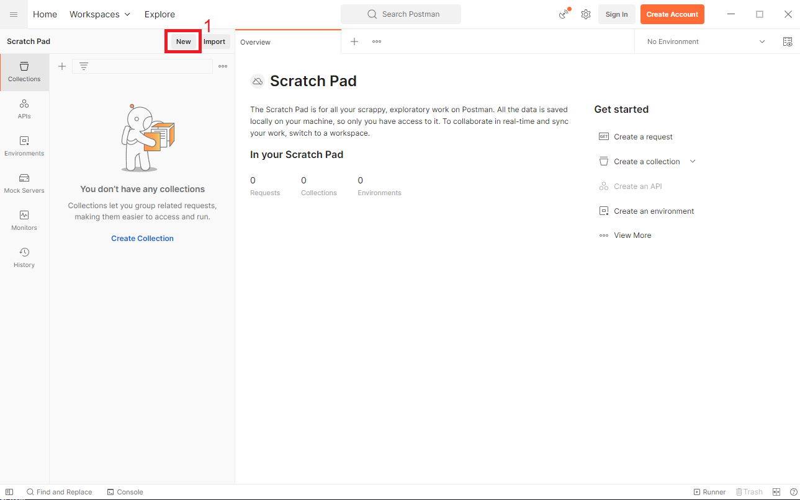
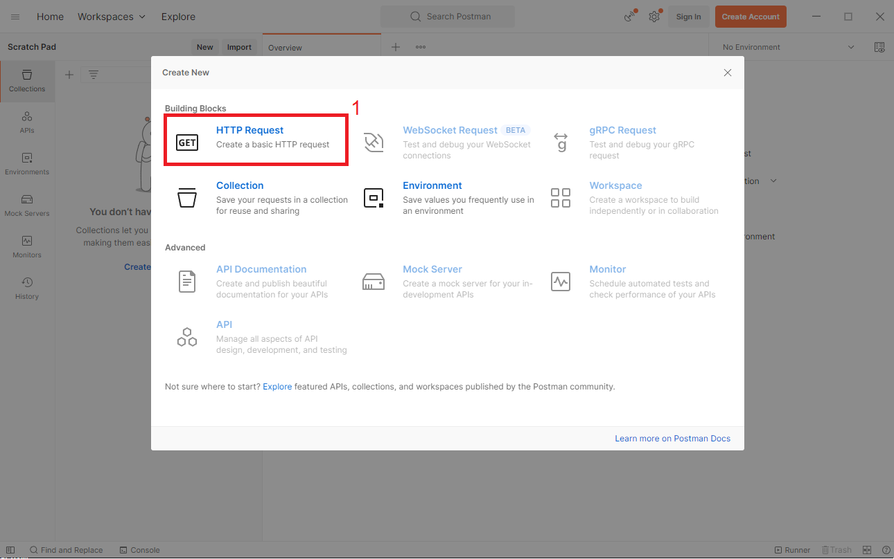
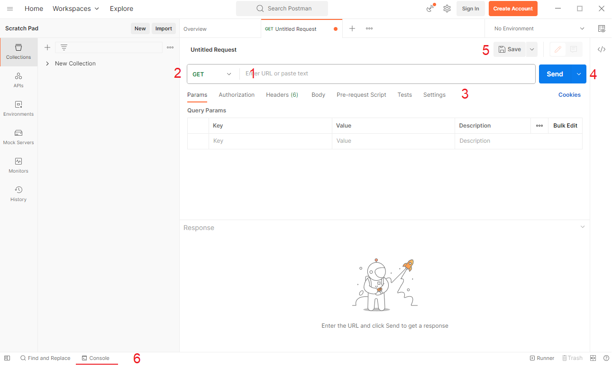
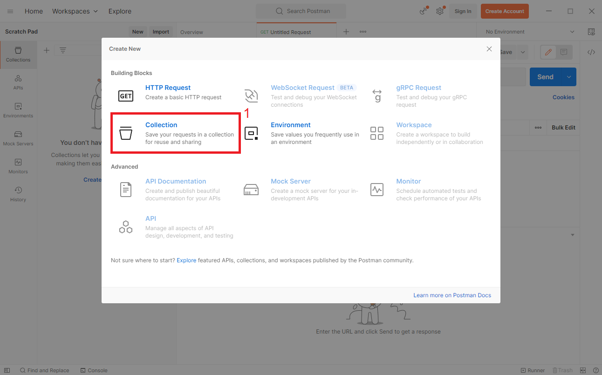
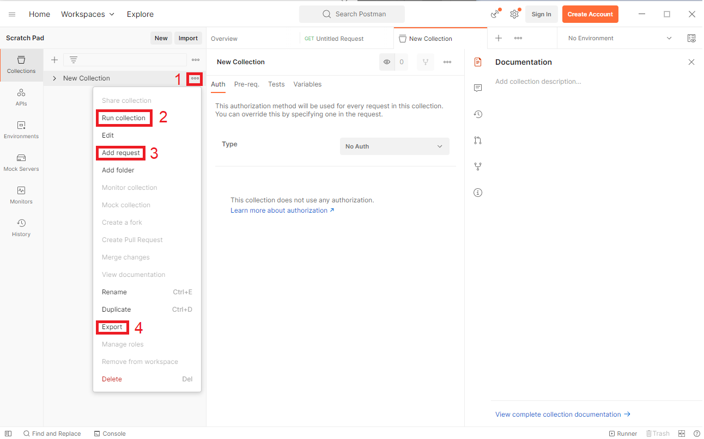
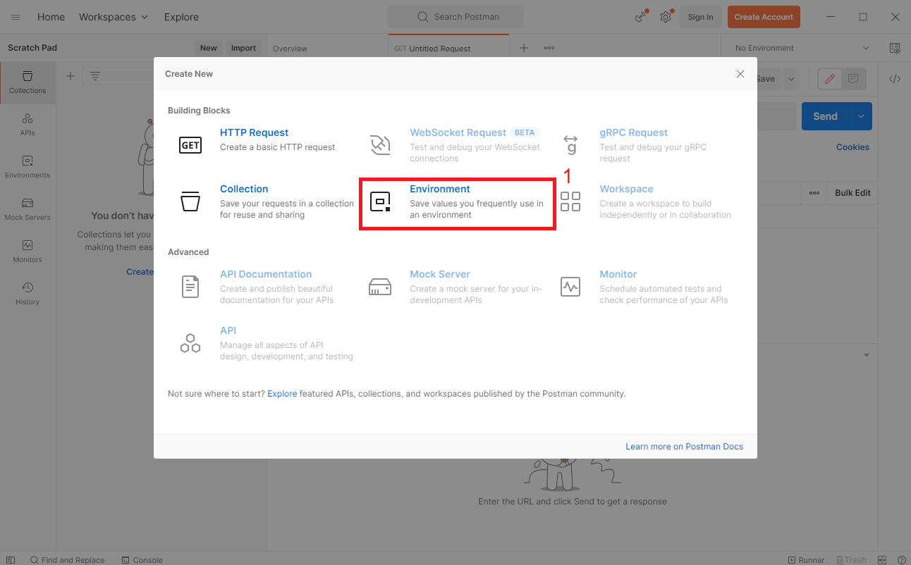
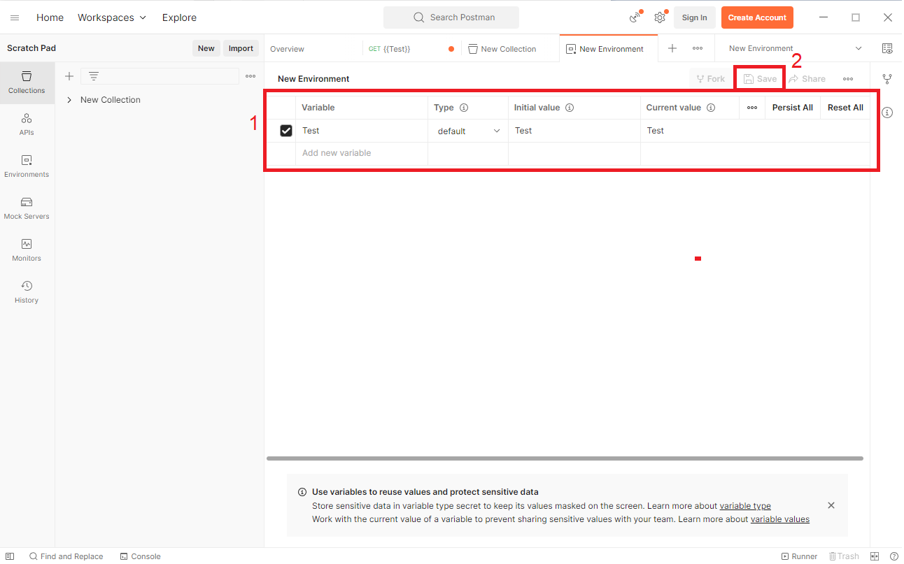
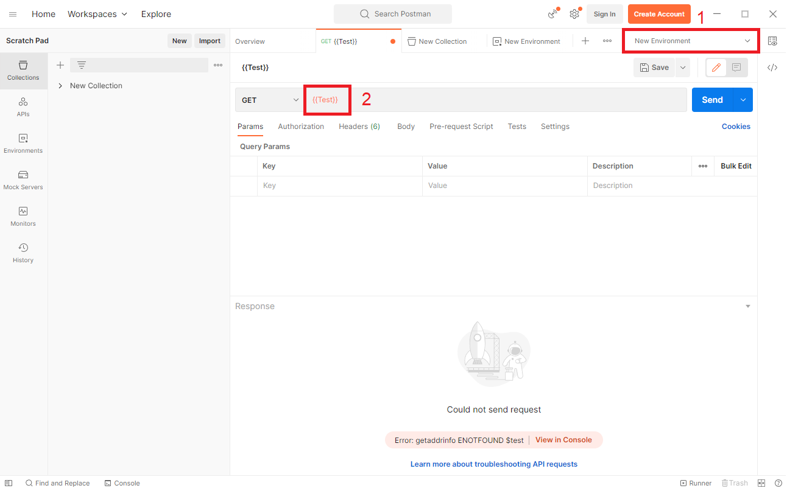

# Implementing a Microservice in Golang

- [Using a PostgreSQL Database](#using-a-postgresql-database)
	- [Connecting to a PostgreSQL Database](#connecting-to-a-postgresql-database)
	- [Migrations](#migrations)
	- [CRUD Operations](#crud-operations)
- [Sending Request to a HTTP API](#sending-requests-to-a-http-api)
	- [Creating a Request](#creating-a-request)
	- [Creating a Collection](#creating-a-collection)
	- [Using Environment Variables](#using-environment-variables)

## Using a PostgreSQL Database

<!-- TODO: -->

To work with a PostgreSQL database the ORM (object-relational manager) GORM is used.
Install the following dependencies in your Golang project:
```sh
go get -u gorm.io/gorm
go get -u gorm.io/driver/postgres
```

The full documentation of GORM can be found here: [GORM Docs](1)

### Connecting to a PostgreSQL Database

To connect GORM to a PostgreSQL database, execute the code snippet below in your application.
HOST, USER, PASSWORD, DB_NAME, and PORT need to be replaced by the values for your database.
The `db` variable will later be used to perform operations on the database.

```go
dsn := "host=HOST user=USER password=PASSWORD dbname=DB_NAME port=PORT sslmode=disable"
db, err := gorm.Open(postgres.Open(dsn), &gorm.Config{})
```

### Migrations

Migrations can be used to create a representation of your Golang structs in a relational database.
Simply call the function `AutoMigrate` on the `db` variable that was created earlier
with a reference to the struct that you want to use with your database.
Golang structs can be annotated by following the type of a struct's field with backticks.
Use the annotation ``gorm:"primaryKey"`` to mark a struct's field as the primary key
of the respective database table.

```go
type User struct {
  Name string `gorm:"primaryKey"`
}

db.AutoMigrate(&User{})
```

You can also link different structs together by creating foreign keys.
Simply annotated the referenced struct with ``gorm:"foreignKey:Number"`` where
Number is the primary key of the referenced struct.
Note that the `CreditCard` struct has to be migrated first because the `User` struct
needs the `CreditCard`'s table to already exist.

```go
type User struct {
  Name string `gorm:"primaryKey"`
  CreditCard CreditCard `gorm:"foreignKey:Number"`
}

type CreditCard struct {
  Number   string `gorm:"primaryKey"`
  UserName string
}

db.AutoMigrate(&CreditCard{}, &User{})
```

### CRUD Operations

The following are examples of performing simple CRUD (Create-Read-Update-Delete) operations
with GORM.

To save an instance of a struct to your database, call `Create` on the `db` variable.
The returned `result` variable contains information about the operation like `result.Error` which is
either an error or nil depending on if the operation succeeded or not.

```go
user := User{Name: "Max Mustermann"}
result := db.Create(&user)
result.Error // returns error or nil
```

To retrieve a single (or the first) instance of a struct, call `First` on the `db` variable
with a reference to an empty instance of that struct. GORM will place the data
that it found in the database into that instance.

```go
var user User
result := db.First(&user)
```

To retrieve multiple instances of a struct, call `Find` on the `db` variable
with a reference to an array of empty instances of that struct. GORM will place the data
that it found in the database into that array.
The returned `result` variable contains information about the operation like `result.RowsAffected`
which represents the number of returned instances.

```go
var users []User
result := db.Find(&users)
result.RowsAffected // returns count of records found
```

To conditionally retrieve instances of a struct, chain the `Where` function into your call.
`Where` can contain any valid SQL WHERE-clause conditions. The `?` in the condition
will be replaced by the second argument to `Where`.

```go
var user User
result = db.Where("name = ?", "Max Mustermann").First(&user)
```

To update an instance that has been saved in the database,
first retrieve the instance from the database.
Then update the instance and pass it to `Save` to persist the updated instance.

```go
var user User
result := db.First(&user)
user.Name = "Max Müller"
result = db.Save(&user)
```

To delete an instance of a struct that has been saved in the database,
first find the instance in the database with a call to `Where`.
To this call you can simply chain a call to the function `Delete` which will delete the found instance. `Delete` also returns the deleted instance just like the read operations.

```go
var user User
result = db.Where("name = ?", "Max Müller").Delete(&user)
```

## Sending Requests to a HTTP API

The tool Postman can be used to send requests to a HTTP API.
To download and install Postman for your platform, follow this guide: [Installing Postman](https://learning.postman.com/docs/getting-started/installation/installation-and-updates/). Note that an account is not needed to use the desktop software.

The full documentation of Postman can be found here: [Postman Docs](2)

### Creating a Request

To create a HTTP request with Postman, first click the New button which is labeled as 1 in the image below.



Then choose the option HTTP request which is labeled as 1 in the image below.



You can now enter the URL of the HTTP request that you would like to send in the field labeled 1 in the image below.
Next to the URL textfield you can also choose the HTTP method that should be used.
This is labeled as 2 in the image below
Below that, labeled as 3, you can set different options for the request like setting query parameters,
headers, and the request body.
You can now send the request by clicking the Send button labeled as 4.
The response to your request will be shown below the request settings.
To save your request, click the Save button which is labeled as 5.
A more detailed log of the request can be found in the console which is located at the bottom of the page and labeled as 6.



### Creating a Collection

Collections can be used to group and persist requests.
To create a Collection with Postman, first click the New button which is labeled as 1 in the image below.


Then choose the option Collection which is labeled as 1 in the image below.



To access the features of a collection, click on the button labeled as 1 in the image below.
The most important features of a collection are:
- Run collection (2): Runs all requests inside of the collection in order.
- Add request (3): Add a new request to the collection.
- Export (4): Saves the collection to a JSON file which can be imported via the important button next to the New button. This is useful for sharing requests with other developers.



### Using Environment Variables

Postman has the option to create environments which contain variables whose values
can be reused across different requests.
To use variables, you must first create a new environment.
To create an Environment with Postman, first click the New button which is labeled as 1 in the image below.


Then choose the option Environment which is labeled as 1 in the image below.



Here you can now create variables by giving them a name and entering their value
in the list labeled as 1.
Once you have created your variables, click the Save button, labeled as 2, to persist your environment so that it can be used.



To use a variable, for example, in a request's URL, you must first select the environment that you created in the top right corner, labeled as 1. Then you can enter the name of the variable into the request's URL field surrounded by double curly-braces as shown in the image below at label 2.



# References

[1]: <https://gorm.io/docs/> GORM

[2]: <https://learning.postman.com/docs/introduction/overview/> Postman
