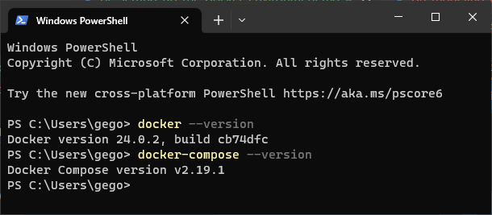

# Setting up the Docker Environment

This guide will walk you through the necessary steps to set up a local deployment environment based on Docker Desktop. Docker Desktop is a comprehensive platform that includes all the tools you need for containerization, including Docker Compose. Follow along to get your environment up and running smoothly.

Note: For Linux users, Docker offers Docker Desktop and Docker Engine. To ensure a consistent and unified experience for all participants, Docker Desktop is the preferred choice.

For Windows, MacOS, and Linux:

1. Check System Requirements and Prepare:
    Before installing Docker Desktop, make sure that your system meets the requirements. Depending on your operating system (OS), you may need to enable features like virtualization support. Refer to the following Docker documentation pages for detailed system requirements specific to your OS:
     * [Mac System Requirements](https://docs.docker.com/desktop/faqs/general/)
     * [Windows System Requirements](https://docs.docker.com/desktop/install/windows-install/#system-requirements)
     * [Linux System Requirements](https://docs.docker.com/desktop/install/linux-install/#system-requirements)

2. Download the Installer

    Visit the [Docker Desktop Download Page](https://www.docker.com/products/docker-desktop/) to download the installer for your operating system. Choose the appropriate installer for Mac, Windows, or Linux.

3. Install Docker Desktop

    Open the installer executable. Follow the installation wizard, which will guide you through the steps necessary to install Docker Desktop.

4. Start Docker Desktop

    After the installation is complete, start Docker Desktop.

    

5. Verify Installation

    Open a terminal window (PowerShell on Windows; Terminal on MacOS or Linux). Run `docker --version` and `docker-compose --version` to check that Docker and Docker Compose have been installed correctly.

    