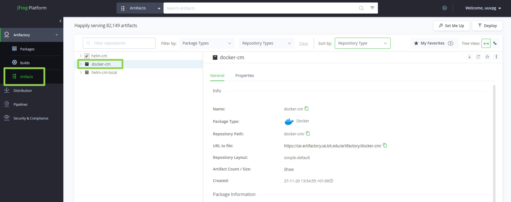

## Use of C&M's Docker Registry

C&M uses Artifactory as a Docker registry provided by the Institute for Automation and Applied Informatics (IAI).
It can be accessed without a VPN connection using the URL [https://iai-artifactory.iai.kit.edu](https://iai-artifactory.iai.kit.edu).
To login, the KIT account with username `uxxxx` is used.

After logging in, C&M's Docker images can be found by navigating to "Artifacts > docker-cm" as shown in the following image.


Figure: C&M Docker Images

The following sections describe how to use Docker in the terminal to interact with C&M's Docker registry.
Thus, a local Doker installation is necessary.
The best practice [Setting up the Docker Environment](https://gitlab.kit.edu/kit/cm/teaching/engineeringknowledge/ume/umephases/-/blob/main/pages/be_setting_up_the_docker_environment.md) describes how to install Docker locally.

## Login
To pull and push Docker images, a login is necessary.
By running the following command, the login is initiated.
Again, the KIT account is used to authenticate.
After running the command, the terminal prompts the password.
If the login succeeded, the message `Login Succeeded` appears.

```bash
docker login iai-artifactory.iai.kit.edu -u <uxxxx>
```

## Push and Pull

The image name must follow the template `iai-artifactory.iai.kit.edu/docker-cm/<NAME>:<TAG>` to push an image to the registry.
The placeholder `<NAME>` refers to the name of the service and must be in lowercase and snake_case.
The placeholder `<TAG>` refers to the Docker image tag and is used to pinpoint specific versions that correspond to Git branches or tags in the GitLab repository of the service.
The tag `latest` is used if the Docker image refers to the latest state of the branch `main`.
Be aware that pushing a Docker image with an already existing tag overwrites the existing Docker image.
If no tag is specified, the tag `latest` will be used to push and pull an image.

For instance, the Docker image of AM-FleetManagementV1.0 is `iai-artifactory.iai.kit.edu/docker-cm/am-fleetmanagementv1-0:latest `.

Use the following command to specify the Docker image name during the build.

```bash
docker build -t iai-artifactory.iai.kit.edu/docker-cm/<NAME>:<TAG> .
```

If the Docker client is already logged in, the image can be pushed using the following command.

```bash
docker push iai-artifactory.iai.kit.edu/docker-cm/<NAME>:<TAG>
```

If the push does not fail, the Docker image will be listed under "Artifacts > docker-cm".

The following command can be used to pull a Docker image.

```bash
docker pull iai-artifactory.iai.kit.edu/docker-cm/<NAME>:<TAG>
```