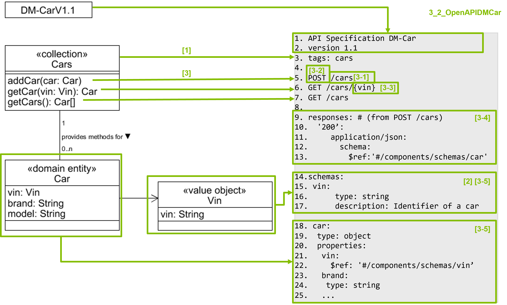

## Derivation of a Domain Microservice API Specification From the API Diagram

This guideline describes a process to systematically derive a Domain Microservice (DM) API specification from the API diagram of the domain microservice. 

An API endpoint is derived for each method in the API diagram using the steps explained below. If one is tempted to create an API endpoint for which no corresponding method exists in the API diagram, it might indicate that the API diagram must be adapted. The API diagram and the API specification must stay aligned. They should NOT differ. 

1. Consider all entities of the API diagram that specify methods. The methods of these core entities will be mapped to API endpoints. For each such entity, introduce a tag named by the entity. Tags are used to group the endpoints to be introduced for the methods specified by the entity. For example, for the API diagram DM-CarV1.1, the collection Cars specifies three methods which are covered under the tag Cars.

2. A schema is created for each entity or value object that is used as an input or output parameter by a method in the API diagram. This schema is named according to the name of the entity or value object in the API diagram. The types and names of the properties are derived in a similar way. In case of an OpenAPI specification, place these schema in the part components. These schema are used in the response or request body (see step [3-4]).

3. For each method of an entity, introduce an endpoint that represents that method. An endpoint has:
 - [3-1] A path that defines the access point to the endpoint. The path name should be derived from the name of the method. However, for CRUD operations, the verb should be omitted. The plural form is commonly used for resource names (car -> cars) following API guidelines (such as Zalando [RESTful API and Event Guidelines](https://opensource.zalando.com/restful-api-guidelines/)). For DM-Car, the path for method addCar is /cars.  If the endpoint should just retrieve resources, an ID may need to be specified in the path to identify the resource. For DM-Car, the path for method getCar is /cars/{vin}.
 - [3-2] An HTTP method that indicates which action is performed on the endpoint. The HTTP method is derived from the semantics of the entity method. If the method is used to create a new resource, the HTTP method POST is chosen. If the method is used to retrieve a resource, GET is chosen instead. E.g., get/view/see --> GET, add/create --> POST, remove --> DELETE, update/change/edit --> PUT/PATCH
 - [3-3] Request parameters that are derived from the input parameters of the corresponding
method. Each input parameter is mapped to a separate request parameter. For GET methods request parameters are often placed directly in the URL as path variables (URL parameters). For example, DM-Car has the method getCar which receives a vin as an input parameter as the identifier for a car to access. This vin is introduced as a path variable in the URL /cars/{vin} to allow the endpoint to access the correct car resource. For other methods, such as POST, PUT, or PATCH, request parameters are commonly placed in the request body and formatted in JSON, XML or other formats. The request body serves as a container for transmitting multiple parameters efficiently.
While both approaches can be used for all HTTP methods, adhering to established standards is recommended.
- [3-4] Derive responses based on the possible answers that the endpoint should deliver. Each endpoint should have at least one response with the status code 200. To derive the response with the status code 200, the return parameter of the corresponding method in the API diagram is used. Furthermore, the previously derived schemas (see step 2) are used. If a specific object is searched via the HTTP GET methoId, the status code 404 should be included as well. To derive further alternative responses, the alternative flows in the use case description that is the source of the method in the API diagram may be helpful.
- [3-5] For reuse purposes, a response schema is defined in the corresponding part of the API specification. For example, in an OpenAPI specification, the schemas are placed in the part components. The responses of an endpoint refer to the defined schema.

The following figure is taken from the WASA course unit MICROSERVICE ENGINEERING, chapter DESIGN.

Figure: Specification of a Domain API with OpenAPI Based on the API Diagram 
