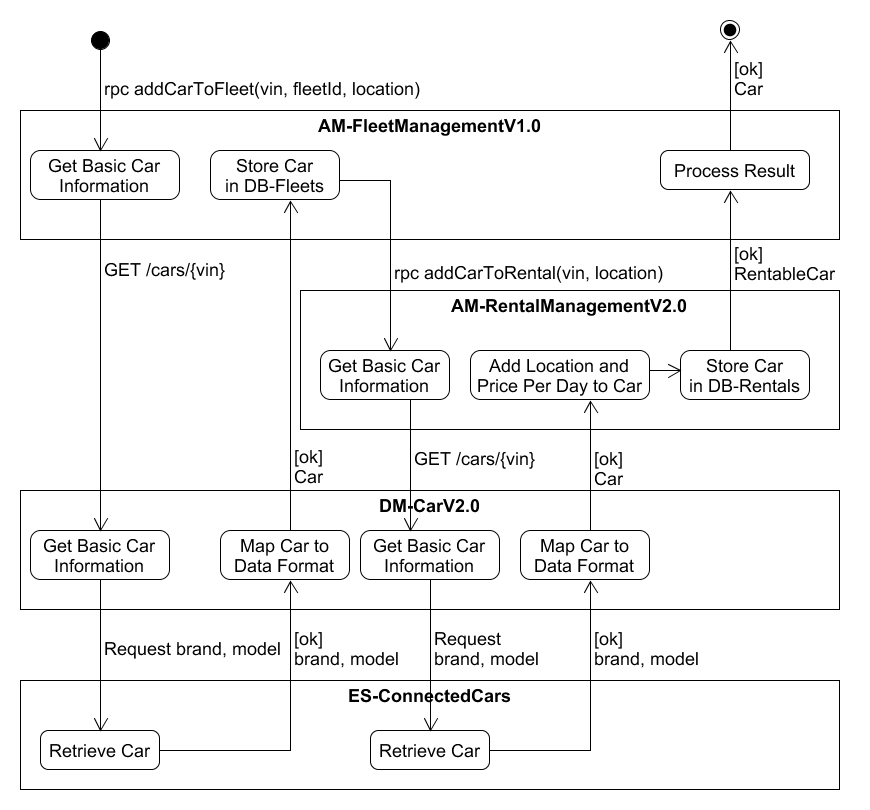

# Modeling of an Orchestration Diagram
This guideline describes the derivation and modeling of an orchestration diagram.

The orchestration diagram starts with the application microservice operation (which is usually triggered by a user interaction).
As the orchestration concerns other application microservices, domain microservices, and external systems, the orchestration diagram includes the required requests, responses, and activities to those microservices.
As running example, the artifacts from [CarRentalAppV2.0](https://github.com/Micha-Git/CarRentalAppV2.0/blob/main/README.md) are used.

The starting point for an orchestration diagram is the considered application microservice operation.

### Step 1: Identify and Model Required Microservices
1. Identify all required microservices from the component diagram and extended component diagram, as well as the API diagram for the application microservice operation based on the required information. Orchestration diagrams are only modeled if additional microservices (or external systems) are required for the microservice operation.
2. For each identified microservice, model a rectangle and add the microservice name including its version number in the top center of the rectangle. Write the name in bold (e.g., **AM-FleetManagementV2.0**). 
3. Sort the microservices in a chronological and logical order (from top to bottom) where application microservices are always on top of domain microservices. The application microservice which operation is modeled by the orchestration diagram is on the top.

### Step 2: Model Requests and Activities
1. For the considered application microservice operation, create an arrow to the first activity of this application microservice.  
_Note: The first application microservice operation is modeled from the starting point (filled circle)_.  
2. Add the name of the request by copying the name of the method from the API diagram (e.g., addCarToFleet(vin:Vin, fleetId:String, location:String) from [AM-RentalManagementV2.0](https://github.com/Micha-Git/CarRentalAppV2.0/blob/main/pages/ad_am-rental_management_v2.0.md)) and remove the types of the input parameters (e.g., addCarToFleet(vin, fleetId, location)).
3. Add "rpc" in front of the microservice operation which leads to rpc methodName(parameter1, parameter2, ..., paramterN). In the example of the orchestration diagram, this leads to "rpc addCarToFleet(vin, fleetId, location)".
4. Briefly model the required functionality of the application microservice as activities (e.g., Get Basic Car Information). An arrow of the request should point to the first activity. In addition, model further required activities. Use title case for modeling the activities.
5. The content of the activities is derived from the use cases which contain the business logic (e.g., System gathers basic car information → Get Basic Car Information). 
   1. If an activity requires to call another microservice operation, proceed as follows, depending on the microservice type:
      1. For application microservices, a "rpc request" is added with the same rules as stated above (rpc methodName(parameters)).
      2. For domain microservices, add the corresponding endpoint by adding the HTTP method and the endpoint (e.g., GET /cars/{vin}). 
      3. Requests to external systems are added by the term "Request" and the required information (e.g., Request brand, model) derived from the information requirements (see use case "[Add Car to Fleet](https://github.com/Micha-Git/CarRentalAppV2.0/blob/main/pages/uc_add_car_to_fleet_v2.0.md)").
   2. Otherwise, responses or further activities are added (see Step 3: Model Responses).

_Note: The requests and responses should always be located between the rectangles of the microservices._ 

### Step 3: Model Responses
1. For each request, the corresponding response is modeled. The response is always sent back to the requesting microservice:
   1. The result is handled by an additional modeled activity which handles the response.
   2. The return values correspond to the return values stated in the API diagram. It is important to use exactly the same names (e.g., "GetCar(vin: Vin):Car" leads to the response Car).  
      1. Note: Responses from external systems contain only the required information for simplicity.
2. Important error messages can be modeled, standard errors should be neglected for readability.

The tackled examples are shown in the Figure "Example Orchestration of the Application Microservice Operation addCarToFleet()" below.  

  
**Figure: Example Orchestration of the Application Microservice Operation addCarToFleet()**
